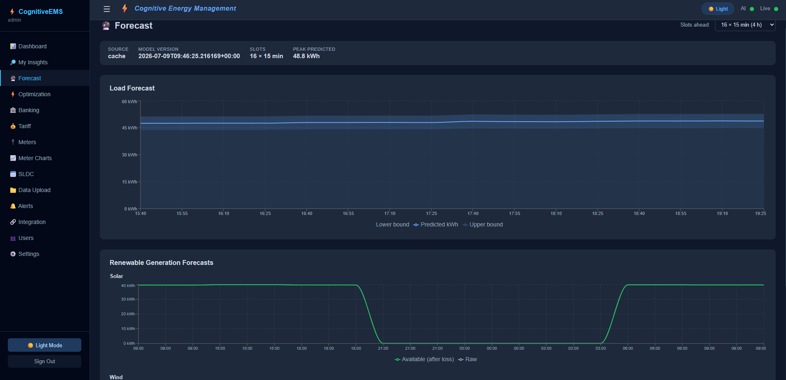
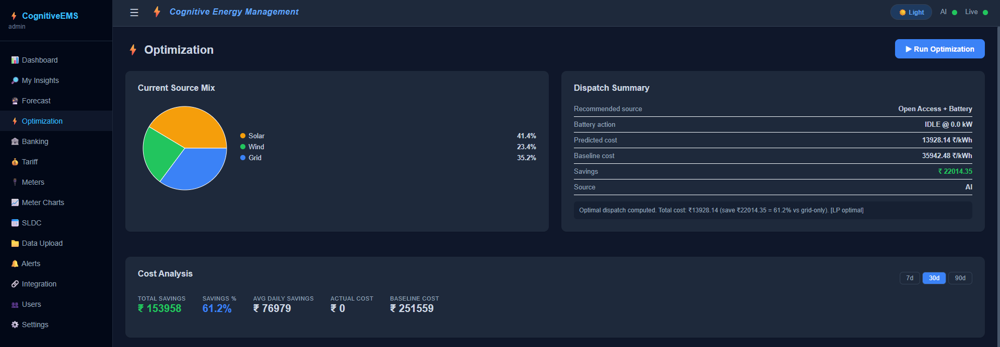
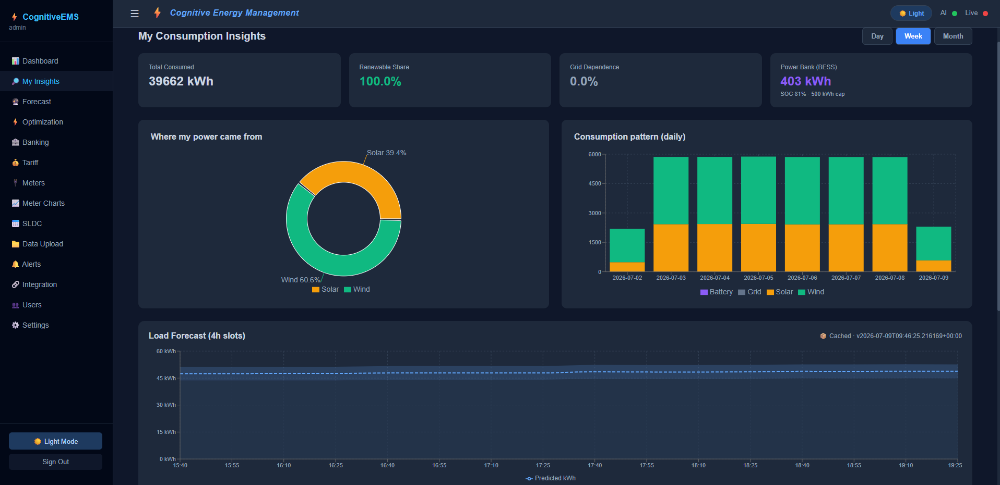
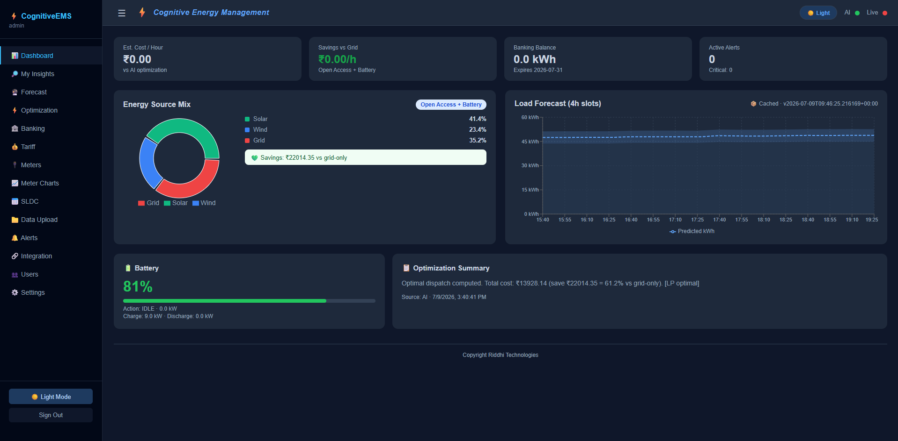
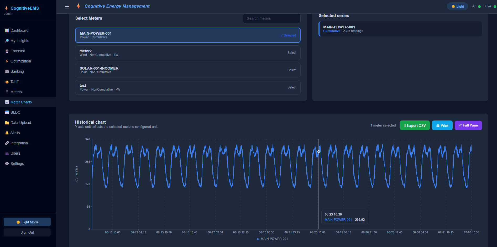
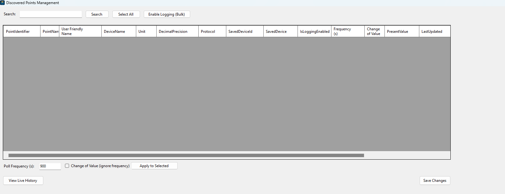
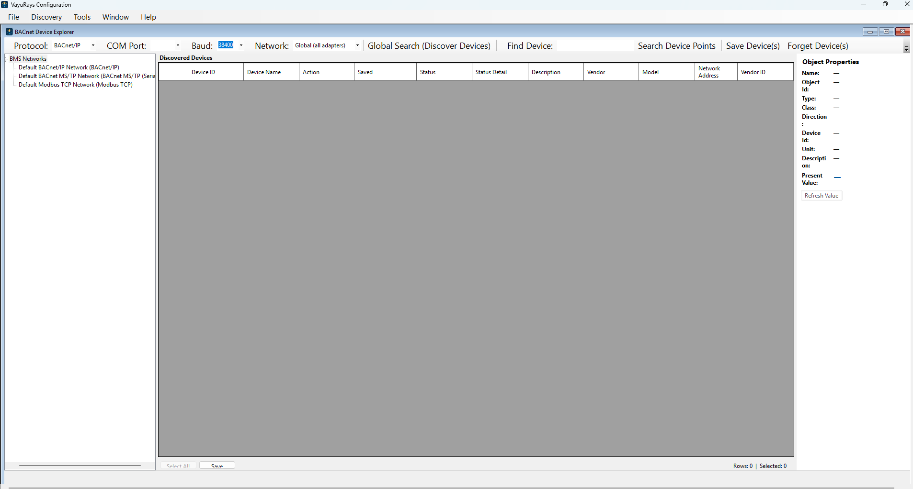

# CognitiveEMS + VayuRays — Brochure Reference Document

## Table of Contents

1. [Combined Solution — Elevator Pitch](#combined-solution--elevator-pitch)
2. [Part 1 — CognitiveEMS](#part-1--cognitiveems)
3. [Part 2 — VayuRays Data Acquisition System](#part-2--vayurays-data-acquisition-system)
4. [Better Together: One Connected Energy Stack](#better-together-one-connected-energy-stack)
---

## Combined Solution — Elevator Pitch

**From raw meter pulse to boardroom decision — in one connected platform.**

VayuRays quietly and reliably collects every reading from your building and plant equipment. CognitiveEMS turns that data into foresight — predicting demand, choosing the cheapest and cleanest energy source in real time, and keeping you compliant with grid regulations. Together, they give industrial and commercial energy teams a single, trustworthy pipeline from **sensor to savings**.

---

## Part 1 — CognitiveEMS

### Tagline Options

- *"Energy intelligence for the industrial enterprise."*
- *"See tomorrow's power needs. Save on today's power bill."*
- *"One dashboard. Every energy source. Zero guesswork."*

### Positioning Statement

CognitiveEMS is an AI-driven energy management platform built for industrial plants and commercial facilities that draw power from multiple sources — solar, wind, battery storage, grid, and open-access power markets. It replaces manual spreadsheets, delayed reporting, and reactive decision-making with **live visibility, predictive intelligence, and automated optimization**.

### Target Audience

- Plant/Facility Energy Managers
- Industrial procurement & sustainability teams
- DISCOM / Open-Access energy consumers
- CFOs and Ops leaders tracking energy spend as a controllable cost

---

### Feature 1 — Predictive Load & Renewable Forecasting

See electricity demand and green-energy generation before it happens. CognitiveEMS forecasts consumption and solar/wind output in fine 15-minute increments, up to a full day ahead, complete with confidence ranges so planners know how much certainty to build into their decisions.

**Key benefits**
- Anticipate demand spikes before they hit the meter
- Plan renewable usage instead of reacting to it
- Reduce reliance on last-minute, high-cost grid power

*Forecast dashboard — predicted load with upper/lower confidence bounds.*

---

### Feature 2 — Automated Source Optimization

At the heart of CognitiveEMS is an intelligent dispatch engine that continuously recommends the most cost-effective, sustainable mix of Solar, Wind, Battery, Grid, and Open-Access power — recalculated automatically as conditions change.

**Key benefits**
- Always dispatch the lowest-cost, cleanest available source
- Transparent, auditable recommendation for every time slot
- Battery charge/discharge guidance built in

*Live source-mix recommendation and dispatch summary.*

---

### Feature 3 — Real-Time Cost & Savings Intelligence

Every optimization decision is measured against a "what it would have cost on grid power alone" baseline — so savings are never a guess, they're a number leadership can trust.

**Key benefits**
- Instant visibility into savings percentage and total ₹ saved
- Historical cost trend charts (7 / 30 / 90-day views)
- Clear actual-vs-baseline comparison for reporting and audits

*Cost Analysis — total savings, savings %, and actual vs. baseline cost history.*

---

### Feature 4 — Live, Unified Operations Dashboard

A single real-time screen brings together cost per hour, savings versus grid, banked energy balance, active alerts, battery health, and the latest optimization summary — all updating live, no page refresh required.

**Key benefits**
- One glance replaces five spreadsheets
- Instant awareness of anything that needs attention
- Designed for control-room displays as well as desk use

---

### Feature 5 — Energy Banking & Open-Access Reconciliation

For facilities that generate their own renewable power and bank surplus units with the grid, CognitiveEMS automatically tracks injected units, withdrawals, running balance, and expiries — removing the manual ledger work that normally falls on plant accountants.

**Key benefits**
- Always know your banked energy position
- Automatic reconciliation reduces manual errors
- Full transaction history on demand

---

### Feature 6 — Time-of-Day Tariff Intelligence

Electricity pricing changes by the hour. CognitiveEMS keeps every applicable tariff slot, surcharge, and wheeling charge current, and includes a built-in comparison calculator so teams can evaluate cost scenarios before committing to a dispatch plan.

**Key benefits**
- Stay current on peak/off-peak/normal tariff structures
- Compare cost scenarios instantly
- Reduce exposure to surprise peak-hour charges

---

### Feature 7 — SLDC Day-Ahead Scheduling & Compliance

For sites participating in open-access power, CognitiveEMS streamlines the mandatory day-ahead scheduling process with grid authorities and tracks how actual consumption deviated from the approved schedule — keeping compliance simple and defensible.

**Key benefits**
- Submit 24-hour schedules in a guided, structured form
- Automatic deviation tracking against approved units
- Reduces regulatory and penalty risk

*Scheduling & compliance workflow (representative screen — confirm exact feature before final placement).*

---

### Feature 8 — Smart Alerts, Built for Action

Instead of digging through logs, operators get severity-ranked alerts the moment something needs attention, with one-click (or bulk) acknowledgment and toast notifications so nothing slips through.

**Key benefits**
- Prioritized by severity, not buried in noise
- Fast acknowledge / acknowledge-all workflow
- Keeps accountability visible across the team

---

### Feature 9 — Effortless Data Onboarding

Bring in consumption, generation, and battery data however it already exists — drag-and-drop CSV/Excel upload, automatic file-drop ingestion, or direct API sync — with a visible import history and progress tracking for every file.

**Key benefits**
- No special file formatting gymnastics required
- Full audit trail of every import
- Works with existing metering and SCADA exports

---

### Feature 10 — Meter Fleet & Historical Analytics

Manage the full meter inventory and drill into historical trends per meter with interactive charts — turning raw historical readings into an analysis-ready view for engineering and finance teams alike.

**Key benefits**
- Centralized meter inventory management
- Rich historical trend charts, exportable for reporting
- Supports root-cause and trend analysis

*Meter history / analytics view (representative screen — confirm exact feature before final placement).*

---

### Feature 11 — Personalized "My Insights" View

Beyond the operations dashboard, individual stakeholders get a tailored insights view: where their power came from, consumption patterns over time, expected renewable generation, and banked energy status — making energy transparency accessible beyond the ops team.

**Key benefits**
- Extends energy visibility to non-technical stakeholders
- Builds internal sustainability accountability
- Simple, digestible visual storytelling of energy usage

---

### Feature 12 — Integration & AI Health Visibility

CognitiveEMS surfaces the live health of every connected data provider and the status of its AI forecasting engine directly in the interface — so nobody has to wonder whether the "smart" in smart energy management is actually running.

**Key benefits**
- At-a-glance confidence in system health
- One-click AI model retraining trigger
- Clear separation between connectivity status and AI health

---

### Feature 13 — Enterprise-Grade Access Control

Role-based access (Administrator, Operator, Viewer) ensures the right people can act, while everyone else retains visibility — supporting both operational agility and governance requirements.

**Key benefits**
- Segregation of duties for compliance-conscious organizations
- Safe visibility for auditors and executives without operational risk
- Secure, modern authentication throughout

---

### Feature 14 — A Workspace Built for Every Shift

A polished, modern interface with full light and dark theme support means the same clarity and legibility whether it's a bright office or a dimmed 24/7 control room.

**Key benefits**
- Reduces eye strain during night-shift monitoring
- Consistent, professional look across all conditions
- Designed for long viewing sessions on control-room displays

---

### CognitiveEMS — Business Outcomes Summary

| Outcome | How CognitiveEMS Delivers |
|---|---|
| Lower energy cost | AI-optimized source dispatch + tariff intelligence |
| Reduced compliance risk | Automated SLDC scheduling & deviation tracking |
| Faster decisions | Real-time dashboard + predictive forecasting |
| Less manual effort | Automated banking reconciliation & data ingestion |
| Organization-wide accountability | Role-based access + personalized insights |

---

## Part 2 — VayuRays Data Acquisition System

### Tagline Options

- *"Every reading, captured. Every device, watched."*
- *"The reliable foundation beneath smarter energy decisions."*
- *"Set it up once. Trust it forever."*

### Positioning Statement

VayuRays is a dependable, always-on data acquisition system for Building Management and industrial control networks. It automatically finds equipment on the network, lets operators choose exactly what to monitor, and continuously and reliably captures readings — providing the clean, trustworthy data foundation that any energy analytics or optimization platform (including CognitiveEMS) depends on.

### Target Audience

- BMS / Building Automation engineers
- Facility operations teams
- Industrial controls & instrumentation teams
- Energy platform integrators needing a reliable acquisition layer

---

### Feature 1 — Automatic Device Discovery

VayuRays scans the network and automatically discovers every compatible building or plant device — no manual point-by-point setup required to get started.

**Key benefits**
- Faster commissioning, less manual configuration
- Nothing on the network gets overlooked
- Works with industry-standard building automation protocols

---

### Feature 2 — Operator-Controlled Point Selection

Once devices are discovered, operators choose exactly which data points matter — and configure how often (or under what conditions) each one is recorded.

**Key benefits**
- Full control over what data is collected and why
- Flexible recording: on a schedule, or only when a value actually changes
- Avoids data overload — capture signal, not noise

*Device discovery and point configuration screen.*

---

### Feature 3 — Always-On, Unattended Collection

VayuRays runs continuously in the background as a system service — collecting data around the clock without requiring an operator to keep an application open or babysit the process.

**Key benefits**
- True 24/7 reliability, independent of user sessions
- Consistent, precisely-timed recording intervals
- Minimal IT overhead to keep running

---

### Feature 4 — Live Communication Health Monitoring

The moment a device stops responding, VayuRays flags it visually — and automatically clears the flag the instant communication is restored. No silent data gaps go unnoticed.

**Key benefits**
- Immediate visibility into network/device issues
- Self-clearing status means no manual reset needed
- Confidence that "no data" is never mistaken for "no problem"

---

### Feature 5 — Live History, Trends & Charting

Every monitored point has a live, auto-updating table and trend chart, so operators can watch current behavior and explore historical patterns side by side.

**Key benefits**
- Instant visual feedback on equipment behavior
- Date-range filtering for focused historical review
- No separate reporting tool required for a quick look-back

*Live history table and trend chart with date-range filtering.*

---

### Feature 6 — One-Click Data Export

Any point's history, for any date range, can be exported instantly — ready to hand to an analyst, auditor, or another system.

**Key benefits**
- Removes friction from ad hoc reporting requests
- Supports compliance and audit documentation
- Clean, ready-to-use exported data

---

### Feature 7 — Time-Zone-Aware Reporting

Readings are always captured on a single, consistent internal clock, then displayed and exported in whatever local time zone the site operates in — critical for multi-site organizations.

**Key benefits**
- Accurate, consistent data across multiple sites/regions
- No confusion when comparing timestamps across locations
- One configuration, correct everywhere

---

### Feature 8 — Transparent System Activity Logging

A live, filterable activity log lets technical teams see exactly what the system is doing at any moment — supporting fast troubleshooting and operational confidence.

**Key benefits**
- Full transparency into day-to-day system operation
- Faster diagnosis when something needs attention
- Builds operator trust in an unattended system

---

### Feature 9 — Modern, Crisp Desktop Experience

The configuration and monitoring application is built for today's high-resolution displays, staying sharp and readable on everything from a laptop to a large control-room monitor.

**Key benefits**
- Comfortable for extended monitoring sessions
- Professional appearance for control rooms and site visits
- Consistent experience across different hardware

---

### VayuRays — Business Outcomes Summary

| Outcome | How VayuRays Delivers |
|---|---|
| Reliable data foundation | Always-on, unattended, scheduled collection |
| Faster issue detection | Real-time communication health monitoring |
| Lower commissioning effort | Automatic device discovery |
| Audit-ready reporting | One-click, time-zone-correct CSV export |
| Multi-site consistency | Centralized storage, time-zone-aware display |

---

## Better Together: One Connected Energy Stack

| Layer | Product | Role |
|---|---|---|
| **Field data capture** | VayuRays | Discovers devices, collects and safeguards every reading, 24/7 |
| **Intelligence & optimization** | CognitiveEMS | Forecasts demand, optimizes source dispatch, manages cost, tariffs, banking & compliance |

**Suggested combined message:**
*"VayuRays gives you data you can trust. CognitiveEMS turns that trust into smarter, cheaper, greener energy decisions — automatically, every 15 minutes, every day."*

Recommended narrative arc for a combined brochure:
1. The energy management challenge (fragmented data, reactive decisions, rising costs)
2. The foundation — VayuRays captures the truth on the ground
3. The intelligence — CognitiveEMS turns truth into action and savings
4. Proof points — dashboards, forecasts, savings, compliance (screenshots)
5. Call to action

   Contact vayurays@gmail.com for free trial

