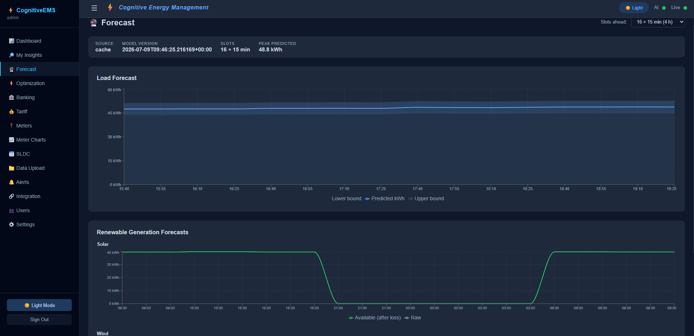
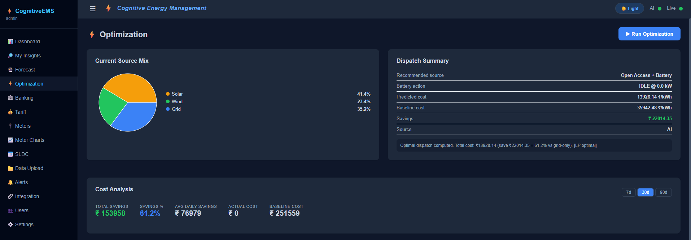
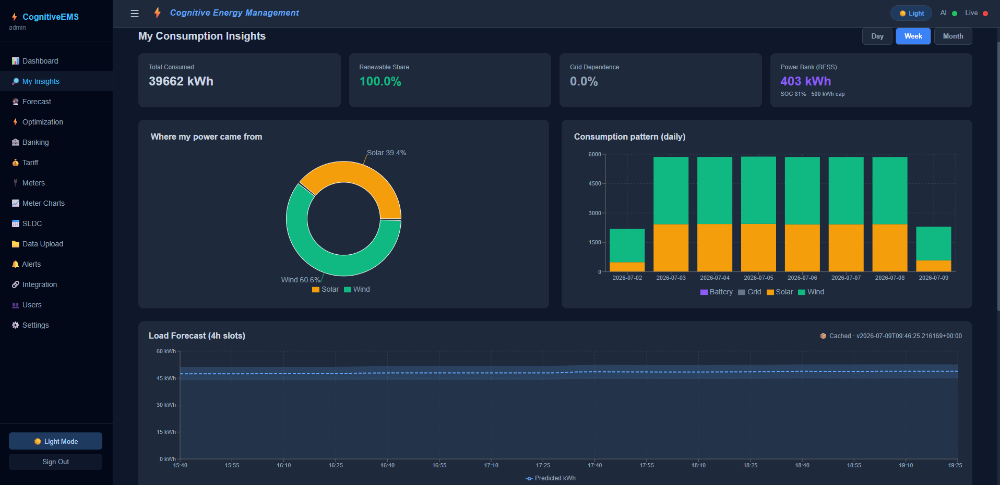
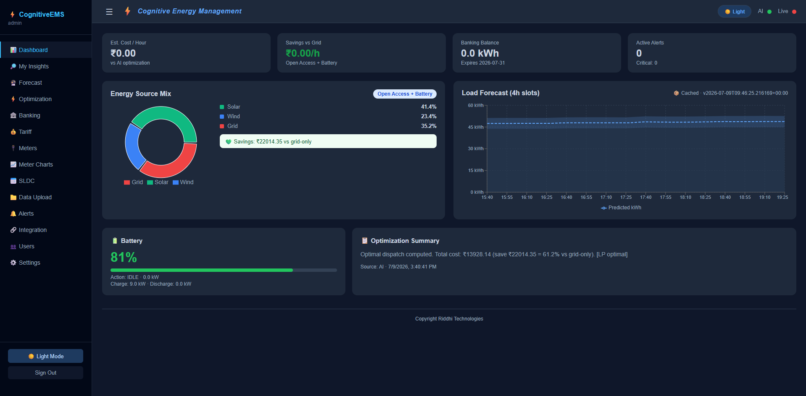
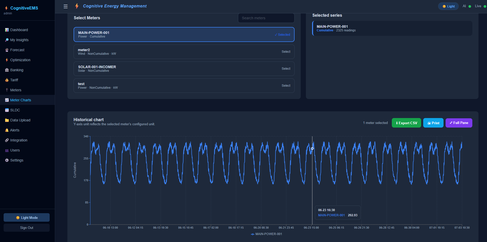

# CognitiveEMS + VayuRays — Brochure Reference Document

## Table of Contents

1. [Combined Solution — Elevator Pitch](#combined-solution--elevator-pitch)
2. [Part 1 — CognitiveEMS](#part-1--cognitiveems)
3. [Part 2 — VayuRays Data Acquisition System](#part-2--vayurays-data-acquisition-system)
4. [Better Together: One Connected Energy Stack](#better-together-one-connected-energy-stack)
---

## Combined Solution — Elevator Pitch

**From raw meter pulse to boardroom decision — in one connected platform.**

VayuRays quietly and reliably collects every reading from your building and plant equipment. CognitiveEMS turns that data into foresight — predicting demand, choosing the cheapest and cleanest energy source in real time, and keeping you compliant with grid regulations. Together, they give industrial and commercial energy teams a single, trustworthy pipeline from **sensor to savings**.

---

## Part 1 — CognitiveEMS

### Tagline Options

- *"Energy intelligence for the industrial enterprise."*
- *"See tomorrow's power needs. Save on today's power bill."*
- *"One dashboard. Every energy source. Zero guesswork."*

### Positioning Statement

CognitiveEMS is an AI-driven energy management platform built for industrial plants and commercial facilities that draw power from multiple sources — solar, wind, battery storage, grid, and open-access power markets. It replaces manual spreadsheets, delayed reporting, and reactive decision-making with **live visibility, predictive intelligence, and automated optimization**.

### Target Audience & Persona-Based Value Propositions

**1. DISCOMs / Open-Access Energy Consumers**
- **The Problem:** They struggle with balancing volatile energy supply and demand, facing heavy penalties for schedule deviations and spending hours manually reconciling banked energy and open-access quotas.
- **The Solution:** CognitiveEMS automates day-ahead SLDC scheduling, deviation tracking, and banking reconciliation.
- **The Value:** Saves operators up to 8–10 hours a week on manual ledger work and day-ahead planning, avoiding costly deviation penalties (potentially saving ₹2,00,000+ monthly in avoided fines and operational effort).

**2. Plant & Facility Energy Managers**
- **The Problem:** Forced to react to energy demand spikes after they occur, lacking real-time visibility into the cheapest available energy source at any given hour.
- **The Solution:** The AI-driven dispatch engine provides 15-minute predictive load forecasting and automatically recommends the lowest-cost power mix (Solar, Wind, Battery, Grid).
- **The Value:** Shifts operations from reactive to proactive. Reduces peak-hour grid reliance, cutting overall energy bills by 10-15% while ensuring uninterrupted facility operations.

**3. CFOs & Operations Leaders**
- **The Problem:** Energy is a massive, opaque operational expense. Finance teams rely on delayed, end-of-month utility bills with no way to track daily actuals versus baselines.
- **The Solution:** The Real-Time Cost & Savings dashboard provides instant visibility into exact rupees saved, with accurate baseline comparisons and live tariff intelligence.
- **The Value:** Turns energy into a predictable, controllable cost. Eliminates bill shocks and provides auditable financial reporting for exact ROI tracking on renewable energy investments.

**4. BMS / Building Automation Engineers & System Integrators**
- **The Problem:** Setting up data acquisition is a nightmare of manual point mapping, protocol mismatches, and fragile polling loops that crash the network.
- **The Solution:** VayuRays offers plug-and-play auto-discovery for BACnet/Modbus, frequency/COV polling, and built-in cascading error circuit breakers.
- **The Value:** Cuts network commissioning time from days to minutes. Ensures 24/7 fail-safe telemetry collection without manual intervention or network storms.

---

### Feature 1 — Predictive Load & Renewable Forecasting

See electricity demand and green-energy generation before it happens. CognitiveEMS forecasts consumption and solar/wind output in fine 15-minute increments, up to a full day ahead, complete with confidence ranges so planners know how much certainty to build into their decisions.

**Key benefits**
- Anticipate demand spikes before they hit the meter
- Plan renewable usage instead of reacting to it
- Reduce reliance on last-minute, high-cost grid power

*Forecast dashboard — predicted load with upper/lower confidence bounds.*

---

### Feature 2 — Automated Source Optimization

At the heart of CognitiveEMS is an intelligent dispatch engine that continuously recommends the most cost-effective, sustainable mix of Solar, Wind, Battery, Grid, and Open-Access power — recalculated automatically as conditions change.

**Key benefits**
- Always dispatch the lowest-cost, cleanest available source
- Transparent, auditable recommendation for every time slot
- Battery charge/discharge guidance built in

*Live source-mix recommendation and dispatch summary.*

---

### Feature 3 — Real-Time Cost & Savings Intelligence

Every optimization decision is measured against a "what it would have cost on grid power alone" baseline — so savings are never a guess, they're a number leadership can trust.

**Key benefits**
- Instant visibility into savings percentage and total ₹ saved
- Historical cost trend charts (7 / 30 / 90-day views)
- Clear actual-vs-baseline comparison for reporting and audits

*Cost Analysis — total savings, savings %, and actual vs. baseline cost history.*

---

### Feature 4 — Live, Unified Operations Dashboard

A single real-time screen brings together cost per hour, savings versus grid, banked energy balance, active alerts, battery health, and the latest optimization summary — all updating live, no page refresh required.

**Key benefits**
- One glance replaces five spreadsheets
- Instant awareness of anything that needs attention
- Designed for control-room displays as well as desk use

---

### Feature 5 — Energy Banking & Open-Access Reconciliation

For facilities that generate their own renewable power and bank surplus units with the grid, CognitiveEMS automatically tracks injected units, withdrawals, running balance, and expiries — removing the manual ledger work that normally falls on plant accountants.

**Key benefits**
- Always know your banked energy position
- Automatic reconciliation reduces manual errors
- Full transaction history on demand

---

### Feature 6 — Time-of-Day Tariff Intelligence

Electricity pricing changes by the hour. CognitiveEMS keeps every applicable tariff slot, surcharge, and wheeling charge current, and includes a built-in comparison calculator so teams can evaluate cost scenarios before committing to a dispatch plan.

**Key benefits**
- Stay current on peak/off-peak/normal tariff structures
- Compare cost scenarios instantly
- Reduce exposure to surprise peak-hour charges

---

### Feature 7 — SLDC Day-Ahead Scheduling & Compliance

For sites participating in open-access power, CognitiveEMS streamlines the mandatory day-ahead scheduling process with grid authorities and tracks how actual consumption deviated from the approved schedule — keeping compliance simple and defensible.

**Key benefits**
- Submit 24-hour schedules in a guided, structured form
- Automatic deviation tracking against approved units
- Reduces regulatory and penalty risk

*Scheduling & compliance workflow (representative screen — confirm exact feature before final placement).*

---

### Feature 8 — Smart Alerts, Built for Action

Instead of digging through logs, operators get severity-ranked alerts the moment something needs attention, with one-click (or bulk) acknowledgment and toast notifications so nothing slips through.

**Key benefits**
- Prioritized by severity, not buried in noise
- Fast acknowledge / acknowledge-all workflow
- Keeps accountability visible across the team

---

### Feature 9 — Effortless Data Onboarding

Bring in consumption, generation, and battery data however it already exists — drag-and-drop CSV/Excel upload, automatic file-drop ingestion, or direct API sync — with a visible import history and progress tracking for every file.

**Key benefits**
- No special file formatting gymnastics required
- Full audit trail of every import
- Works with existing metering and SCADA exports

---

### Feature 10 — Meter Fleet & Historical Analytics

Manage the full meter inventory and drill into historical trends per meter with interactive charts — turning raw historical readings into an analysis-ready view for engineering and finance teams alike.

**Key benefits**
- Centralized meter inventory management
- Rich historical trend charts, exportable for reporting
- Supports root-cause and trend analysis

*Meter history / analytics view (representative screen — confirm exact feature before final placement).*

---

### Feature 11 — Personalized "My Insights" View

Beyond the operations dashboard, individual stakeholders get a tailored insights view: where their power came from, consumption patterns over time, expected renewable generation, and banked energy status — making energy transparency accessible beyond the ops team.

**Key benefits**
- Extends energy visibility to non-technical stakeholders
- Builds internal sustainability accountability
- Simple, digestible visual storytelling of energy usage

---

### Feature 12 — Integration & AI Health Visibility

CognitiveEMS surfaces the live health of every connected data provider and the status of its AI forecasting engine directly in the interface — so nobody has to wonder whether the "smart" in smart energy management is actually running.

**Key benefits**
- At-a-glance confidence in system health
- One-click AI model retraining trigger
- Clear separation between connectivity status and AI health

---

### Feature 13 — Enterprise-Grade Access Control

Role-based access (Administrator, Operator, Viewer) ensures the right people can act, while everyone else retains visibility — supporting both operational agility and governance requirements.

**Key benefits**
- Segregation of duties for compliance-conscious organizations
- Safe visibility for auditors and executives without operational risk
- Secure, modern authentication throughout

---

### Feature 14 — A Workspace Built for Every Shift

A polished, modern interface with full light and dark theme support means the same clarity and legibility whether it's a bright office or a dimmed 24/7 control room.

**Key benefits**
- Reduces eye strain during night-shift monitoring
- Consistent, professional look across all conditions
- Designed for long viewing sessions on control-room displays

---

### CognitiveEMS — Business Outcomes Summary

| Outcome | How CognitiveEMS Delivers |
|---|---|
| Lower energy cost | AI-optimized source dispatch + tariff intelligence |
| Reduced compliance risk | Automated SLDC scheduling & deviation tracking |
| Faster decisions | Real-time dashboard + predictive forecasting |
| Less manual effort | Automated banking reconciliation & data ingestion |
| Organization-wide accountability | Role-based access + personalized insights |

---

## Part 2 — VayuRays Data Acquisition System

### Tagline Options

- *"Every reading, captured. Every device, watched."*
- *"The multi-protocol, fail-safe foundation beneath smarter energy decisions."*
- *"Set it up once. Host your custom apps. Trust it forever."*

### Positioning Statement

VayuRays is a robust, enterprise-grade data acquisition system and extensible application host for industrial networks and building management systems. It natively supports standard protocols (BACnet & Modbus) to auto-discover network devices, offers dual polling modes (Frequency & Change-of-Value), prevents network storms via advanced circuit breakers, and serves as a plug-and-play host for custom backend and frontend web applications — providing a unified, secure, and auditable foundation for utility management.

### Target Audience

- BMS / Building Automation engineers
- Facility managers & industrial ops teams
- Systems integrators looking for an extensible data acquisition layer
- Security & compliance teams requiring complete audit logs and role-based access

---

### Feature 1 — Multi-Protocol Automatic Device Discovery

VayuRays scans building networks to auto-discover devices across four industry-standard protocols, completely eliminating manual point-by-point setup.

**Key benefits**
- **Broad Protocol Support:** Natively speaks BACnet/IP, BACnet MS/TP (serial RS-485), Modbus TCP, and Modbus RTU.
- **Plug-and-Play Setup:** Commission networks in minutes instead of days.
- **Central Device Registry:** Auto-resolves and maintains device addresses dynamically.

---

### Feature 2 — Advanced Acquisition Modes (COV & Frequency-Based Polling)

Define exactly how each point is logged to optimize database storage and capture critical transitions.

**Key benefits**
- **Frequency-Based Polling:** Poll points at custom intervals (minimum 1 second base cycle up to 900 seconds).
- **Change-of-Value (COV) Logging:** Read values continuously but only write records to database history on value change.
- **Smart Data Deduplication:** Native validation prevents writing duplicate active history records.

---

### Feature 3 — Always-On Loop with Pluggable Drivers

Runs as a lightweight background Windows Service, utilizing an extensible provider architecture that isolates communication logic.

**Key benefits**
- **Independent Reliability:** 24/7 background operation unaffected by user login sessions.
- **Extensible Drivers:** Pluggable drivers (`IProtocolDriver` and `ProtocolDriverManager`) allow adding new protocols without core codebase changes.
- **Resource Efficient:** High concurrency handling with customizable batching (e.g., ReadPropertyMultiple batching for BACnet).

---

### Feature 4 — Communication Health & Fail-Safe Circuit Breaker

VayuRays features visual network monitoring combined with a smart circuit breaker to isolate failures.

**Key benefits**
- **Self-Healing Indicators:** Instantly flags communication errors per point and clears them once resolved.
- **Cascading Failure Protection:** Built-in circuit breakers isolate slow or dead controllers after a configurable error threshold, preventing network retry storms.
- **Filtered Log Spam:** Warns about undiscovered devices once per device instead of flooding system logs.

---

### Feature 5 — Custom App Extensibility Framework

VayuRays acts as a secure, lightweight application host. Developers can drop custom backend DLLs and frontend React assets directly into the service.

**Key benefits**
- **Zero-Configuration App Discovery:** Backend controllers are dynamically loaded, and frontend apps are automatically served at `/apps/{Plugin}` and rendered inside the main UI.
- **Shared Dependency Pipeline:** Plugins inherit host DI containers (`VayuDbContext`, `ILiveValuePublisher`, loggers) and automatically inherit JWT authentication pipelines.
- **Seamless Frontend Mounting:** Custom apps render inside the sidebar in protected `iframe` elements, with JWT tokens passed automatically.

---

### Feature 6 — Point-Level Alarm Rules & Bulk Acknowledge-All

Configure flexible rule definitions directly on analog, binary, or multi-state values.

**Key benefits**
- **Condition Matching:** Supports greater-than, less-than, equal-to, not-equal-to, and boolean check rules.
- **Visual Modal Configuration:** Manage rules locally in a batch grid with easy save-all modifications.
- **Single-Click Bulk Acknowledgement:** Clean up active alarms and RTN-acknowledge resolved alarms in a single click per point.

---

### Feature 7 — Cryptographically Signed Security Audit Logging

Track every critical system interaction to satisfy regulatory compliance requirements.

**Key benefits**
- **Full Traceability:** Logs every rule creation, rule edit, rule delete, write command, and settings modification.
- **Tamper-Evident Signatures:** Uses cryptographic signatures to verify that logs have not been modified externally.
- **Timezone-Aware Reporting:** UI displays logs in the system's configured timezone, and exports matching timezone-corrected CSV reports.

---

### Feature 8 — Enterprise-Grade Access Control & Hardened Licensing

Protect critical configurations from unauthorized changes and enforce license compliance.

**Key benefits**
- **API-Enforced Role Restrictions:** Restricts all POST/PUT/DELETE write operations strictly to `Administrator` and `Operator` roles—completely blocking read-only `Viewer` users from Postman/API level tampering.
- **Machine-Bound Licensing:** Validates Host ID, expiration dates, and point limits using native decryption utilities.

---

### VayuRays — Business Outcomes Summary

| Outcome | How VayuRays Delivers |
|---|---|
| Pluggable Ecosystem | Drop in custom apps (backend controllers + React frontends) that load dynamically |
| Cascading Error Defense | Per-device circuit breakers isolate slow or dead equipment to protect polling cycles |
| Multi-Protocol Compatibility | Connects BACnet/IP, BACnet MS/TP, Modbus TCP, and Modbus RTU devices |
| High-Fidelity Data Logging | Frequency-based and Change-Of-Value acquisition modes to capture clear telemetry |
| Compliance Auditing | Cryptographically signed Security Audit Logs tracking configuration changes |
| Hardened API Security | Strict API-level role validation preventing read-only Viewers from posting modifications |
| Quick Troubleshooting | Single-click Point Alarm Ack & Clear, live comm health flags, and timezone-aware displays |

---

## Better Together: One Connected Energy Stack

| Layer | Product | Role |
|---|---|---|
| **Field data capture** | VayuRays | Discovers devices, collects and safeguards every reading, 24/7 |
| **Intelligence & optimization** | CognitiveEMS | Forecasts demand, optimizes source dispatch, manages cost, tariffs, banking & compliance |

**Suggested combined message:**
*"VayuRays gives you data you can trust. CognitiveEMS turns that trust into smarter, cheaper, greener energy decisions — automatically, every 15 minutes, every day."*

Recommended narrative arc for a combined brochure:
1. The energy management challenge (fragmented data, reactive decisions, rising costs)
2. The foundation — VayuRays captures the truth on the ground
3. The intelligence — CognitiveEMS turns truth into action and savings
4. Proof points — dashboards, forecasts, savings, compliance (screenshots)
5. Call to action

   Contact vayurays@gmail.com for free trial

